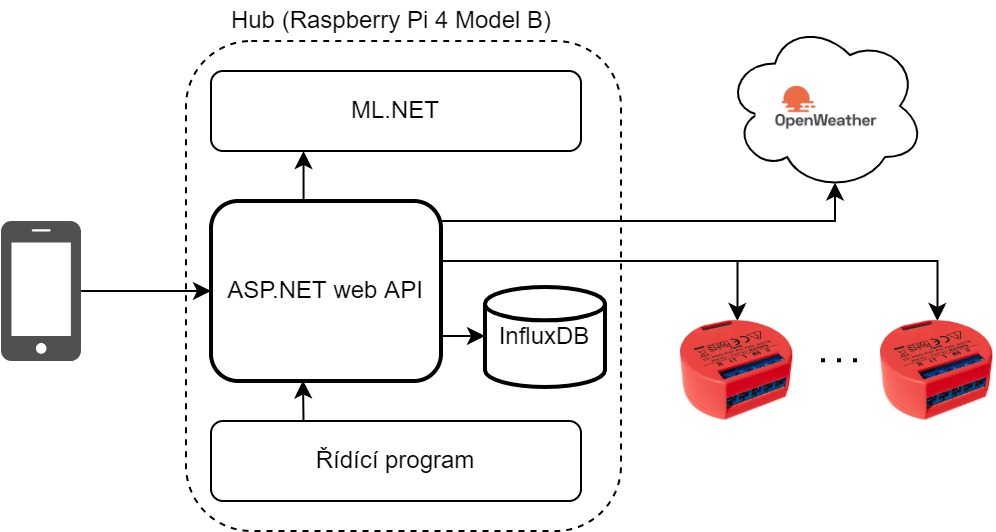
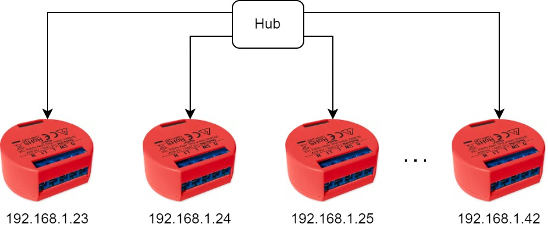

# **Chytrá domácnost: učící se řízení vytápění** (IBT 2022)

Více informací obsahuje [textová část](https://github.com/tommilostny/IBT_2022_doc).

---

**Vedoucí**:
Materna Zdeněk, Ing., Ph.D., UPGM FIT VUT

**Student**:
Milostný Tomáš

**Jazyk práce**:
čeština

**Zadání**:
1. Proveďte rešerši existujících řešení pro řízení zdroje tepla a jednotlivých termostatických ventilů.
1. Navrhněte hardwarovou i softwarovou část vlastního řešení umožňující zlepšování řízení v čase.
1. Realizujte navržené řešení.
1. Ověřte funkčnost řešení dlouhodobým testem.
1. Vytvořte video prezentující vaši práci, její cíle a výsledky.

---

Prezentace ITT: https://vutbr-my.sharepoint.com/:p:/g/personal/xmilos02_vutbr_cz/Ed84ZmY7SilPmpHFyKVLyYcBZhtywX-_Ho-cplwBSBTktA?e=9HP8Xz

---
## Použité technologie
* Hardware:
    * Shelly 1PM (ovládání topení)
    * Shelly Temperature Sensor Addon + DS18B20 teplotní senzor
    * **Hub**: Raspberry Pi 4 Model B (nasazení ovládacího sofware)
* Software:
    * C# 10.0, .NET 6.0
        * ML.NET (framework pro strojové učení)
        * ASP.NET web API (wrapper pro akce se Shelly API, ML, přístup k DB)
        * MAUI (multiplatformní aplikační uživatelské rozhraní)
    * InfluxDB (databáze optimalizovaná pro práci s časovými řadami)

---
## Architektura aplikace
Byla zvolena platforma .NET, která poskytuje veškeré nástroje potřebné pro implementaci tohoto projektu také v jednotném jazyce C#.

Aplikace je rozdělena na 2 hlavní části - klientskou (MAUI) a serverovou (systém běžící na centrálním zařízení, např. Raspberry Pi 4 Model B), která slouží jako hlavní hub pro ovládání relé Shelly pomocí strojového učení (ML.NET) a lokální ukládání dat do databáze.

---
## Shelly
Ovládání a získávání dat (o teplotě a stavu topení) ze zařízení Shelly 1PM s teplotním senzorem.
Pracovat se bude s elektrickým přímotopem připojeným do zásuvky ovládané tímto relé.

Program bude využívat příkaz [Shelly REST API](https://shelly-api-docs.shelly.cloud/gen1/#shelly1-shelly1pm), které lze posílat lokálně na IP adresu zařízení.

Jednotlivá Shelly zařízení mají záznamy v databázi rozlišené dle IP adresy (device ID?).

---
## [ML.NET](https://dotnet.microsoft.com/en-us/apps/machinelearning-ai/ml-dotnet)
Framework pro strojové učení pro .NET platformu nabízí mnoho nástrojů pro různé [ML úlohy](https://docs.microsoft.com/en-us/dotnet/machine-learning/resources/tasks?WT.mc_id=dotnet-35129-website).
Pro tuto práci je zazímavá sekce **Forecasting** pro práci s daty v časové sérii.
Zde je nabízen algoritmus [SSA](https://docs.microsoft.com/en-us/dotnet/api/microsoft.ml.timeseriescatalog.forecastbyssa). Více o forecasting v ML.NET např. [zde](https://docs.microsoft.com/en-us/dotnet/machine-learning/tutorials/time-series-demand-forecasting).

Toto bude periodicky provádět **scheduler Coravel** běžící pod webovým API.

---
## [MAUI](https://docs.microsoft.com/en-us/dotnet/maui/what-is-maui)
Uživatel nastavuje zařízení Shelly klasicky přes aplikaci nebo webové rozhraní k tomu určené.
Pro přístup k těmto zařízení bude jako nástavba vytvořena jednoduchá multiplatformní mobilní aplikace komunikující s webovým API běžícím na hubu (RPi 4). 

Tato aplikace by měla také uživateli umožnit, podobně jako aplikace od výrobce, zobrazit aktuální teplotu a stav daného topení i manuální ovládání (zapnutí/vypnutí bez ohledu na běžící automatické ovládání (volá endpoint pro přidání záznamu s akcí pro učení preferencí daného uživatele)).
